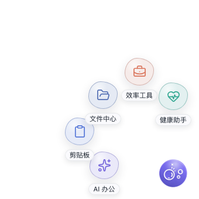
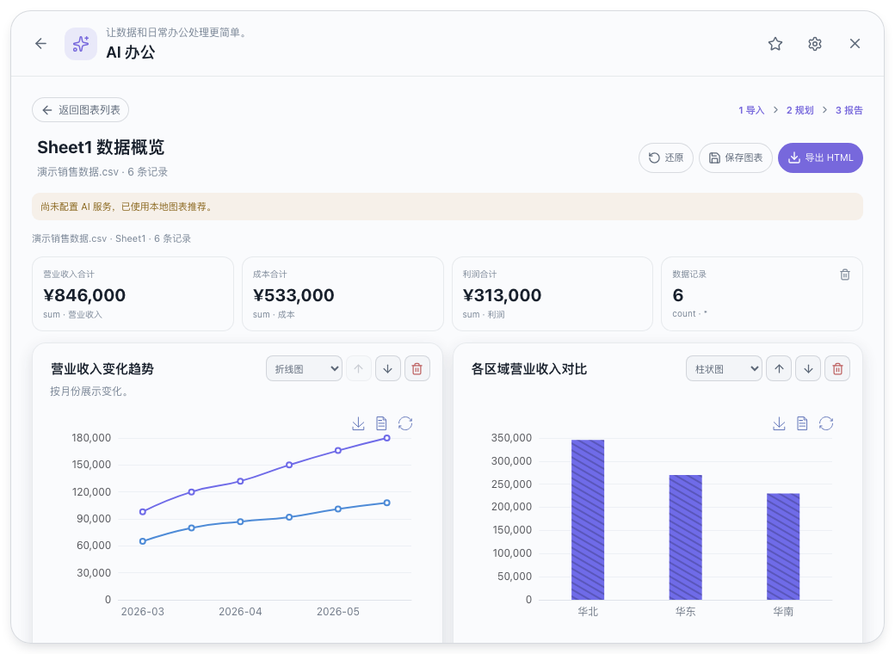
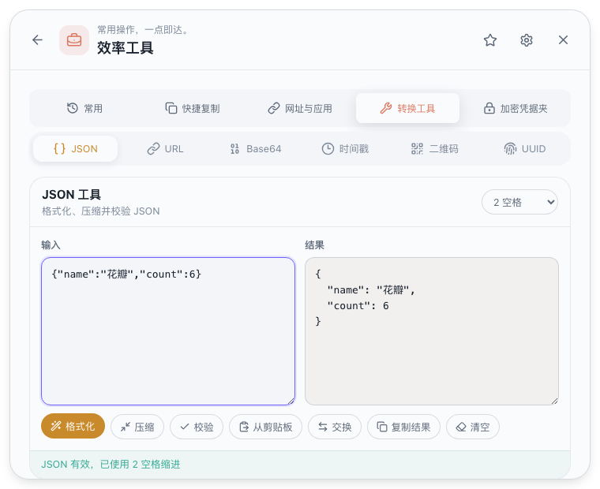

# 冒泡用户说明书

版本：0.1.0

适用对象：第一次接触“冒泡”的普通用户、办公人员和开发人员

最后更新：2026-09-14

---

## 1. 认识“冒泡”

“冒泡”是一款常驻桌面边缘的轻量办公与开发工具箱。它不是传统的大窗口软件：启动后，桌面上只保留一个紫色悬浮球；需要功能时单击悬浮球，再从花瓣菜单进入对应工具。

它主要解决四类问题：

- 自动协助：按计划进行健康提醒，自动保存剪贴板历史。
- 快速转换：处理 JSON、URL、Base64、时间戳、二维码和 UUID。
- 快速访问：打开常用目录、转换路径、中转文件、复制日期时间、访问常用网址或应用，并在本地加密保存工作凭据。
- 表格洞察：在本机解析 Excel/CSV，用本地规则或可选 AI 规划生成可交互图表报告。

核心功能按离线使用设计，不需要注册账号，也不会把剪贴板、凭据或转换内容上传到网络。Excel 智能图表仅在用户配置 DeepSeek 并主动生成时发送脱敏后的字段概况和少量样例，Excel 文件本身不会上传。

> 当前版本以 macOS 作为开发和测试环境，Windows 11 x64 是正式验收目标。Windows 安装包以及部分系统级行为仍需实机验证，详见“平台说明”。

本文截图来自当前版本的自动化界面预览，使用的文字、网址、文件路径和凭据均为演示数据，不包含真实用户内容。

## 2. 五分钟快速上手

### 2.1 启动

获得构建好的应用后：

1. 在 macOS 中双击“冒泡.app”。
2. 应用启动后，桌面边缘会出现紫色悬浮球。
3. 如果暂时看不到悬浮球，可从系统菜单栏中的“冒泡”托盘图标选择“显示/隐藏悬浮球”。

开发人员从源码运行时，可在项目目录执行：

```bash
pnpm install
pnpm tauri dev
```

### 2.2 打开功能

单击悬浮球后会展开五个花瓣：

1. AI 办公
2. 剪贴板
3. 文件中心
4. 效率工具
5. 健康助手



单击任意花瓣会打开对应功能面板。面板顶部包含：

- 左上角返回按钮：关闭面板并重新展开五个花瓣。
- 星标按钮：收藏当前功能分类。
- 齿轮按钮：进入设置。
- 右上角关闭按钮：关闭面板，只保留悬浮球。

关闭面板不会退出应用，健康提醒和剪贴板监听仍会在后台运行。

### 2.3 退出

需要彻底停止“冒泡”时，使用以下任一方式：

- 系统托盘菜单 → “退出”。
- 设置 → 数据与应用 → “退出应用”。

直接关闭功能面板不等于退出。

## 3. 悬浮球与日常操作

### 3.1 单击、双击与拖动

- 单击：展开或收回五个花瓣。
- 拖动：将悬浮球移动到屏幕四边；松开后自动吸附。
- 贴边半隐藏：悬浮球空闲约 3 秒后向屏幕边缘收起一部分，鼠标移近时恢复。
- 双击：可在设置中指定直接打开“效率工具”“剪贴板”或“效率工具 → 转换工具”；默认不设置。

设置双击动作后，单击会短暂等待，以区分用户是在单击还是双击，这是正常现象。

### 3.2 全局快捷键

默认快捷键为 `Ctrl+Alt+Space`，用于显示、隐藏或展开悬浮球。即使当前正在使用其他软件，也可以调用。

修改路径：设置 → 行为 → 全局快捷键。

为避免系统冲突，新快捷键必须包含至少两个修饰键。只有新组合注册成功后，旧快捷键才会失效。

### 3.3 键盘操作

| 操作 | 快捷键 |
|---|---|
| 逐层关闭弹窗、面板或花瓣 | `Esc` |
| 执行当前转换工具 | `Ctrl/Cmd+Enter` |
| 复制转换结果 | `Ctrl/Cmd+Shift+C` |
| 聚焦当前搜索或输入区域 | `Ctrl/Cmd+K` |

按钮、输入框和开关均支持键盘焦点。系统启用“减少动态效果”后，花瓣、倒计时环等动画会自动降级，但功能和计时不会停止。

### 3.4 Excel 智能图表

进入方式：悬浮球 → AI 办公 → Excel 智能图表。

1. 页面首先显示已保存图表。点击已有项目可直接回到字段调整与规划阶段；点击“新建图表”再选择 `.xlsx`、`.xls`、`.csv`，也可把文件拖入面板。文件上限为 50 MB，超过 20 MB 会提示处理可能较慢。
2. 多工作表文件先选择 Sheet；检查系统推断的表头行、字段名称和字段类型，必要时手动修正。字段名称不能为空或重复，改名会同步到报告标题、统计卡片和图例。
3. 未配置 AI 时点击“使用本地方案生成”；已配置 DeepSeek 时可生成 AI 规划，失败会自动回退本地方案。
4. 在报告中修改标题、切换图表类型、调整顺序或删除图表；统计卡片也可删除，并可用顶部提示逐项撤销。“还原”恢复刚生成的结构。
5. 点击“保存图表”后先输入图表名称，再把当前选中 Sheet、字段和报告配置保存在本机。已保存列表支持单独重命名，列表名称不会修改报告标题；点击“导出 HTML”选择位置，导出文件已包含图表运行代码，可断网打开和分享。

打开已保存项目后，“保存图表”会显示为“更新保存”，用于覆盖该项目的字段和报告配置。列表中的删除操作只删除“冒泡”保存的项目，不会删除原始 Excel 或 CSV 文件。



KPI 和图表数值始终由本机读取的原始数据计算。日期标签沿用表格里的显示文本，不会添加 `Z`、UTC 偏移或其他时区。发送给 AI 的内容仅包含字段名、类型、基础统计和最多 12 行样例；疑似身份证、手机号、银行卡、邮箱、密码或 Token 的样例会显示为 `[REDACTED]`。

## 4. 健康提醒

健康提醒适合长时间坐在电脑前工作的人。进入方式：悬浮球 → 健康助手。


### 4.1 默认提醒

| 项目 | 默认状态 | 默认间隔 | “稍后”时长 |
|---|---:|---:|---:|
| 起立活动 | 开启 | 50 分钟 | 10 分钟 |
| 喝水 | 开启 | 45 分钟 | 10 分钟 |
| 远眺护眼 | 开启 | 30 分钟 | 5 分钟 |
| 坐姿调整 | 关闭 | 40 分钟 | 10 分钟 |

每个提醒可以独立开启或关闭、设置 5～1440 分钟的间隔、选择 5/10/15/20 分钟的稍后时长、查看今日完成次数、调试预览或删除。删除项目会停止后续排期，既有统计仍保留。

### 4.2 新增提醒

点击“新增提醒”，填写项目标题、提醒时显示的项目介绍、5～1440 分钟的间隔，以及是否立即启用。自定义提醒默认使用 10 分钟的“稍后”时长，创建后仍可修改。

### 4.3 到点后的行为

到达提醒时间时，悬浮球进入青绿色呼吸状态，旁边出现提醒卡片。卡片外围的绿色圆角环代表 30 秒倒计时。


- 点击“完成”：立即记为完成、增加今日次数，并按正常间隔重新计时。
- 点击“稍后”：按该项目的稍后时长再次提醒，不增加完成次数。
- 30 秒内不操作：系统默认按“完成”处理，然后关闭卡片。

提醒不会一直堆叠。多个项目同时或先后到达时，界面只显示队首的一张卡片；后续提醒即使还没有显示，也会从预定时间起在后台独立进行 30 秒计时，不需要先手动关闭前一项。

### 4.4 暂停与勿扰

面板顶部可以暂停 30 分钟、暂停 1 小时或选择“今日不再提醒”。面板底部还可以开启全局静默，或配置支持跨午夜的勿扰时间。

勿扰结束后，系统会重新计算排期，不集中补发过期提醒。设备休眠期间未实际触发、醒来时已经错过的提醒会直接撤销本次提醒，并从唤醒时间重新排期；不会在唤醒后补弹，也不会记为完成。

## 5. 剪贴板

剪贴板功能自动记录复制过的文本与图片，方便找回刚才被覆盖的内容。进入方式：悬浮球 → 剪贴板。


### 5.1 收录和分类

文本会显示为文本、链接、JSON、代码、颜色或邮箱；标签只用于筛选，不会改写原文。截图工具只有在把位图写入系统剪贴板后，图片才会进入历史；仅保存到文件的截图无法被监听。

### 5.2 查找和使用

- 顶部搜索框查找文本，类型标签筛选内容。
- 点击卡片正文重新复制。
- 卡片可以收藏、固定或删除。
- 图片可以打开大图预览后复制。
- 勾选多项后批量删除。
- “清空非收藏记录”保留收藏内容。
- “暂停记录”停止新增，但不会删除已有历史。

完全相同的内容连续出现时不会生成重复卡片，只更新时间和复制次数。

### 5.3 保留规则

- 普通文本默认保留 30 天，最多 2000 条。
- 图片默认保留 7 天，最多 200 条。
- 收藏或固定项目不会自动过期，直到用户主动删除。

### 5.4 敏感内容保护

“自动跳过敏感内容”默认开启。本地规则检测到疑似密码、验证码、银行卡号、私钥或访问令牌时，不写入普通历史，只显示轻提示。关闭保护前会出现风险提示。

规则检测不能识别所有秘密信息，复制敏感内容后仍应谨慎。

## 6. 效率工具：转换工具

转换工具包含六个离线工具。进入方式：悬浮球 → 效率工具 → 转换工具。



### 6.1 JSON 工具

支持格式化、压缩、校验、2/4 空格缩进、交换输入与结果、从剪贴板填入、复制和清空。语法错误会显示可读位置；字符串不会被修改，也不会执行输入中的代码。超过 2 MB 的文本会使用后台处理并提示。

### 6.2 URL 编码

支持 `encodeURIComponent`、`encodeURI`、解码、查询参数转 JSON、JSON 转查询参数和已编码输入识别。

### 6.3 Base64

支持 UTF-8 文本编码/解码、图片转 Base64、Base64 图片预览，以及 Data URL 与纯 Base64 切换。无效输入会显示错误，图片超过 5 MB 时会提示。

### 6.4 时间戳

支持 10 位秒级和 13 位毫秒级时间戳转换、日期时间转时间戳、本地时间与 UTC 对照、显示时区以及复制当前时间戳。

### 6.5 二维码


可以从非空文本生成二维码并保存 PNG，也可上传不超过 15 MB 的常见图片识别二维码并复制结果。生成、识别和结果都在本机处理，不上传，也不写入历史。

### 6.6 UUID

可以生成 UUID v4，一次生成 1、5、10 或 20 个；支持去除连字符、转大写、复制单项或复制全部。

## 7. 文件中心

进入方式：悬浮球 → 文件中心。面板按“常用位置”“临时中转”“日期文件夹”“路径工具”排列。


### 7.1 常用位置

一键打开下载、桌面、文档等系统目录，也可添加自己的项目或资料目录。自定义入口支持改名、排序和删除；失效路径会明确标记。删除入口不会删除实际文件夹。

### 7.2 临时文件中转

拖入文件/文件夹，或用按钮选择。应用会复制副本到私有临时区：

- 源文件不会移动或删除。
- 显示原路径、大小、添加和过期时间。
- 副本默认 7 天后清理。
- 固定后不会自动清理。
- 删除中转项目只删除副本。

它适合短期周转，不应当作长期备份。

### 7.3 日期文件夹

选择父目录和 `YYYY-MM-DD`、`YYYYMMDD` 或“日期 + 主题”格式，确认预览后点击“创建并打开”。同名目录存在时不会覆盖，而是直接打开。

### 7.4 路径工具

- Windows 转 Unix：`C:\\Users\\demo\\file.txt` → `C:/Users/demo/file.txt`。
- Windows 转 WSL：`C:\\Users\\demo` → `/mnt/c/Users/demo`。
- 可识别的 WSL 路径转 Windows。
- 拖入文件或目录后复制完整路径、文件名或父目录。

转换只处理文字格式，不会访问、移动或修改文件。

## 8. 效率工具

效率工具包含“常用”“快捷复制”“网址与应用”“转换工具”“加密凭据夹”五页。其中“转换工具”见上一节。


### 8.1 常用

最近使用自动保存最近 8 项，再次使用会回到顶部。在任意功能面板点击右上角星标可收藏该分类，最多收藏 12 项。

### 8.2 快捷复制

一键复制当前日期、当前时间、日期时间、10 位秒级时间戳、13 位毫秒时间戳或随机 UUID v4。

### 8.3 常用网址与应用

网址只允许 `http://` 和 `https://`，支持命名、颜色、编辑、排序和删除，点击后由默认浏览器打开。

常用应用通过系统选择器添加 macOS 应用、Windows 可执行文件或快捷方式，支持排序和删除。启动前会重新检查路径，失效时明确提示。

## 9. 加密凭据夹

进入路径：悬浮球 → 效率工具 → 加密凭据夹。


它用于保存系统名称、用户名、密码和备注，是效率工具中的独立子页，不是云端密码管理器。

### 9.1 第一次使用

输入两次主密码并点击“创建凭据夹”。两次必须一致且不能为空；少于 8 个字符时会提示风险。主密码不会保存，也不能找回，请自行妥善保管。

### 9.2 管理凭据

解锁后可新增、编辑、删除，按系统名称或用户名搜索；点击眼睛图标可显示密码，10 秒后自动恢复掩码。系统名称和密码必填，用户名和备注可选。当前版本不能修改主密码。

### 9.3 锁定

关闭功能面板、退出应用、手动锁定或达到无活动时间后，凭据夹都会锁定。自动锁定可在设置 → 行为中选择 1、5、15 或 30 分钟，默认 5 分钟。

搜索、查看、编辑和复制会刷新活动时间。当前没有接入系统锁屏或电脑休眠时立即锁定；离开电脑前建议主动点击“锁定”。

### 9.4 复制保护

- 用户名和密码不进入“冒泡”自己的普通剪贴板历史。
- 密码默认 15 秒后尝试清空系统剪贴板，用户名为 30 秒。
- 只有剪贴板仍是刚复制的内容时才清空；期间复制的新内容不会被误删。

macOS 无法提供与 Windows 等价的系统剪贴板历史排除，其他剪贴板管理工具仍可能记录。Windows 系统历史和云剪贴板保护仍需实机验证。

### 9.5 忘记主密码

主密码无法找回。只能在锁定页点击“忘记主密码？”，经过两次确认永久删除整个凭据夹，然后重新初始化。删除后无法恢复。普通的“清除数据”默认不会删除凭据夹。

## 10. 设置

从功能面板齿轮按钮或系统托盘的“设置”进入。

### 10.1 常规

- 主题：跟随系统、浅色、深色。
- 悬浮球尺寸：48～68 px。
- 悬浮球透明度：60%～100%。
- 开机自动启动：登录后只显示悬浮球，不主动打开面板。

### 10.2 行为

| 模式 | 健康提醒 | 剪贴板记录 |
|---|---|---|
| 工作模式 | 正常显示 | 正常记录 |
| 静默模式 | 暂停弹卡 | 继续记录 |
| 完全暂停 | 暂停 | 暂停 |

模式也可从托盘切换，重启后保留。此页还可以设置全局快捷键、双击动作和凭据夹自动锁定时间。

### 10.3 AI 服务

服务商当前固定为 DeepSeek。API Key 保存到 macOS Keychain 或 Windows Credential Manager，不进入普通设置、SQLite 或日志。首次使用时输入 Key 并保存；输入框为空时不能保存。保存后可以输入新 Key 替换、测试连接或移除现有 Key。可选择 V4 Flash（默认）或 V4 Pro。

### 10.4 数据与应用

“清除数据并保留设置”删除剪贴板历史与图片缓存、提醒统计、临时中转副本、最近使用和已保存智能图表项目，保留主题、收藏、快捷键、提醒配置及常用入口。原始 Excel、CSV 和已导出的 HTML 不会被删除。

“清除数据并重置设置”还会恢复默认设置并关闭开机启动。

两种清理都不会删除原始文件，也默认不删除加密凭据夹。只有主动勾选“加密凭据夹”并通过额外的永久删除确认后，凭据才会删除。

## 11. 数据、隐私与安全

### 11.1 本地数据

- Tauri Store：主题、悬浮球、模式、快捷键、提醒、常用入口、AI 模型和隐私提示状态。
- SQLite：剪贴板历史、提醒日志、最近使用、临时中转记录、加密凭据和已保存智能图表项目。
- 应用私有目录：剪贴板图片缓存和中转副本。

### 11.2 凭据加密范围

凭据的系统名称、用户名、密码和备注会整体加密保存。主密码和派生密钥不持久化，解锁密钥只在运行内存中存在。

只有凭据夹内容使用这层应用加密；普通剪贴板、提醒、图片缓存和临时副本不是整库加密。凭据在解锁、显示或复制时仍会短暂存在于内存或系统剪贴板中，不能替代磁盘加密、企业 DLP/EDR 或成熟商业密码管理器。

### 11.3 网络

核心功能没有账号、云同步、广告或遥测。用户主动点击常用网址时，地址会交给系统浏览器打开；用户主动使用 Excel 智能图表的 AI 规划时，只有界面明示的脱敏 `DataProfile` 会发送给 DeepSeek。Excel 文件、完整工作表、剪贴板和凭据不会上传。

## 12. 常见问题

### 看不到悬浮球

从系统托盘选择“显示/隐藏悬浮球”，尝试默认快捷键 `Ctrl+Alt+Space`，并确认应用进程仍在运行。

### 关闭面板后为什么程序还在

后台提醒和剪贴板监听需要进程常驻。请使用托盘或设置中的“退出应用”。

### 健康提醒没有弹出

检查运行模式、项目开关、全局静默、勿扰、临时暂停和“今日不再提醒”；可点击项目的“调试”按钮预览。

### 为什么提醒自己消失了

提醒卡显示 30 秒后会默认按“完成”处理，以避免无人操作时不断堆叠。设备休眠期间错过且未实际显示的提醒则会直接撤销，不计为完成。

### 截图没有进入历史

确认截图工具把图片写入系统剪贴板，并检查“暂停记录”及“完全暂停”是否开启。

### 复制内容没有被记录

内容可能与最近一项相同，或被识别为敏感内容。凭据夹复制的用户名和密码也会被主动排除。

### 全局快捷键无效

组合可能被系统或其他软件占用。到设置 → 行为换一个包含至少两个修饰键的组合。

### 开机启动设置失败

开发模式或受限环境可能禁止注册。请使用打包应用并检查系统登录项权限。

### 删除中转副本会影响原文件吗

不会。中转区只管理应用自己的副本。

### 凭据夹无法解锁

确认主密码正确。主密码无法找回；确定忘记后只能永久删除凭据夹并重建。

### 清理后凭据为什么还在

这是默认保护。必须主动勾选凭据夹并完成额外永久删除确认。

### macOS 首次打开被拦截

当前内部测试包为 ad-hoc 签名，没有 Developer ID 签名和 Apple 公证，仅供本机测试。正式分发前仍需签名、公证和 Gatekeeper 验收。

## 13. 平台说明

### macOS

当前用于开发和跨平台逻辑验证。凭据复制会避开“冒泡”自己的历史并按条件清空，但不能保证第三方剪贴板工具不记录。

### Windows 11 x64

正式验收目标。多显示器缩放与透明命中、图片剪贴板、全局快捷键、开机启动、外部应用、Windows 凭据剪贴板保护、安装升级卸载及长时间稳定性仍需实机验证。

### Linux

不在第一版验收范围。

---

遇到问题时，可结合 [产品说明](product-spec.md)、[开发进度](progress.md) 和 [发布检查清单](release-checklist.md) 判断能力是已验证、待平台验证或当前未提供。
